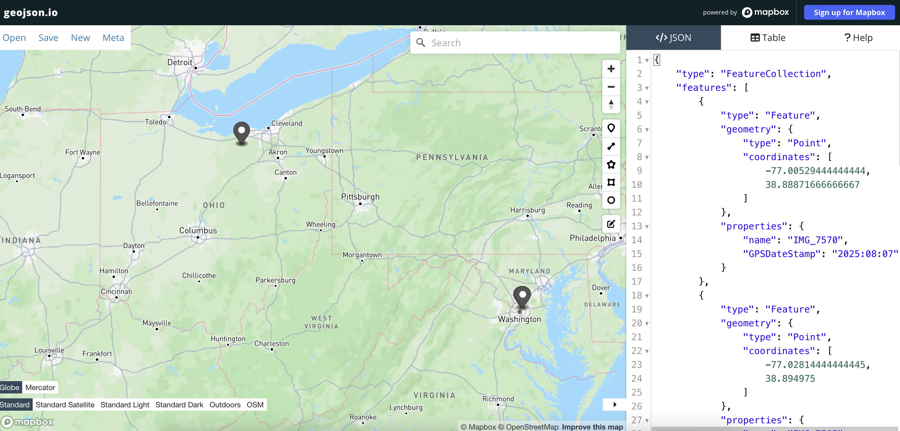

Python utility to generate GeoJSON from photos stored in Apple's HEIC format. Turns an iPhone into an on the fly georecording device for quickly mapping locations during on-the-beat reporting.

## Possible applications

As a student at Columbia's Lede Program, I quickly generated a map of all the trees in a three block radius in Manhattan by walking the streets and snapping a photo next to each trunk. I then dropped the photos in a folder, ran the script, and uploaded the GeoJSON to datawrapper.

I have also used a similar technique to map real-time reporting from student protests and plot warning bollards placed to mark an underground gas pipeline near campus.

## Quickstart

Navigate to your project directory and clone this repository by running:


```python
git clone https://github.com/declanrjb/photo-locator
```

In a new Python script or the interpreter, run:


```python
import photolocator as pl
```

By default, `locate_photos` will return a complete GeoJSON as raw text. Each photo is represented as a point geometry with non-coordinate properties from the original file stored under `properties`.


```python
pl.locate_photos('<photo_dir>')
```

The optional outpath flag writes the GeoJSON to a specified file path.


```python
pl.locate_photos('<photo_dir>', '<out_name>.geojson')
```

GeoJSON can then be reformatted for the user's preferred mapmaking tool using [geojson.io](https://geojson.io/).

## Worked Examples

Using arbitrary photos stored in `demo/samples`:


```python
import photolocator as pl
pl.locate_photos('demo/samples', outpath='demo/photos.geojson')
```

The visualized data shows that the photos were succesfully located:


